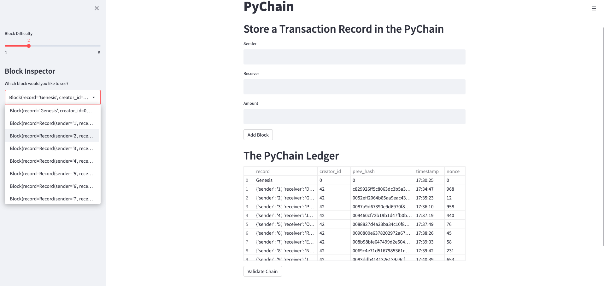
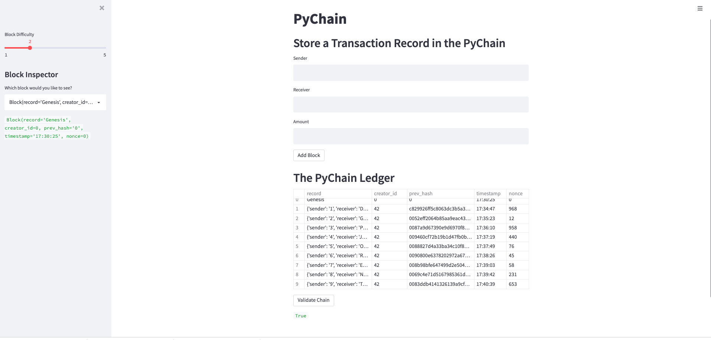

# PyChain Ledger

I built a blockchain-based ledger system, complete with a user-friendly web interface. This ledger allows partner banks to conduct financial transactions (that is, to transfer money between senders and receivers) and to verify the integrity of the data in the ledger.

I made the following updates to the provided Python file for this assignment, which already contains the basic `PyChain` ledger structure:

1. Create a new data class named `Record`. This class will serve as the blueprint for the financial transaction records that the blocks of the ledger will store.

2. Modify the existing `Block` data class to store `Record` data.

3. Add Relevant User Inputs to the Streamlit interface.

4. Test the PyChain Ledger by Storing Records.

## Verify the block contents and hashes in the Streamlit dropdown menu. 

## Test the blockchain validation process by using the web interface. 
